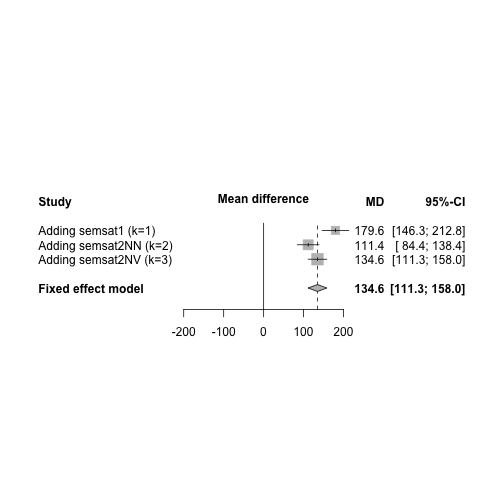
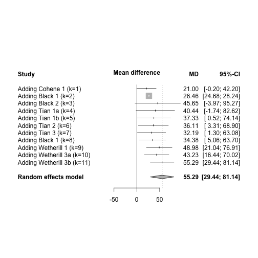

Meta-Analysis of Semantic Satiation
========================================================

Or: Flailing Around in the Dark
-------------------------------


```
## Loading required package: grid
## Loading 'meta' package (version 3.5-1).
```


Let's start easy and do a proof-of-concept meta-analysis of my own semsat1a and semsat2 studies:

```r
# meta <- matrix(c(263,1847.21,54.06,264,1729.43,50.99,
# 243,2261.24,94.44,243,2240.65,95.98, 243,2339.60,96.55,243,2206.07,89.30),
# nrow=3, ncol=6, byrow=TRUE,
# dimnames=list(c('semsat1','semsat2NN','semsat2NV'),
# c('Exp.n','Exp.m','Exp.se', 'Ctrl.n','Ctrl.m','Ctrl.se')))

meta <- matrix(c(66, 1766.4, 104.89, 66, 1586.85, 89.17, 81, 2141.39, 142.54, 
    81, 2163.05, 158.47, 81, 2267.05, 169.95, 81, 2063.75, 128.8), nrow = 3, 
    ncol = 6, byrow = TRUE, dimnames = list(c("semsat1", "semsat2NN", "semsat2NV"), 
        c("Exp.n", "Exp.m", "Exp.se", "Ctrl.n", "Ctrl.m", "Ctrl.se")))

meta <- data.frame(meta)
meta.1 <- metacont(Exp.n, Exp.m, Exp.se, Ctrl.n, Ctrl.m, Ctrl.se, studlab = list("semsat1", 
    "semsat2NN", "semsat2NV"), data = meta, comb.random = TRUE, prediction = TRUE, 
    sm = "MD")
meta.1
```

```
##               MD           95%-CI %W(fixed) %W(random)
## semsat1   179.55 [146.34; 212.76]     49.42      33.79
## semsat2NN -21.66 [-68.08;  24.76]     25.30      33.10
## semsat2NV 203.30 [156.86; 249.74]     25.28      33.10
## 
## Number of studies combined: k=3
## 
##                         MD              95%-CI      z  p.value
## Fixed effect model   134.6 [  111.294;  158.0] 11.302 < 0.0001
## Random effects model 120.8 [   -9.929;  251.5]  1.811   0.0701
## Prediction interval        [-1551.774; 1793.4]                
## 
## Quantifying heterogeneity:
## tau^2 = 12878.6162; H = 5.43 [3.78; 7.81]; I^2 = 96.6% [93%; 98.4%]
## 
## Test of heterogeneity:
##      Q d.f.  p.value
##  58.98    2 < 0.0001
## 
## Details on meta-analytical method:
## - Inverse variance method
## - DerSimonian-Laird estimator for tau^2
```

```r
metacum(meta.1, pooled = "fixed")
```

```
## 
## Cumulative meta-analysis (Fixed effect model)
## 
##                             MD         95%-CI  p.value        tau^2
## Adding semsat1 (k=1)     179.6 [146.3; 212.8] < 0.0001   0         
## Adding semsat2NN (k=2)   111.4 [ 84.4; 138.4] < 0.0001   19818.7127
## Adding semsat2NV (k=3)   134.6 [111.3; 158.0] < 0.0001   12878.6162
##                                                                    
## Pooled estimate          134.6 [111.3; 158.0] < 0.0001   12878.6162
##                              I^2
## Adding semsat1 (k=1)            
## Adding semsat2NN (k=2)     97.9%
## Adding semsat2NV (k=3)     96.6%
##                                 
## Pooled estimate            96.6%
## 
## Details on meta-analytical method:
## - Inverse variance method
```

```r
forest(metacum(meta.1, pooled = "fixed"))
```

 


Let's start by loading in and preprocessing our data:

```r
download.file("https://raw.githubusercontent.com/faulconbridge/semsatMeta/master/effectSizes.csv", 
    "effectSizes.csv", "wget", extra = "--no-check-certificate")
effectSizes <- read.csv("effectSizes.csv", header = TRUE, sep = ",")

repetitions <- effectSizes[!is.na(effectSizes$s.e), ]
View(repetitions)

meta <- metacont(n.e, m.e, s.e, n.c, m.c, s.c, studlab = c(paste(repetitions$Article, 
    repetitions$Experiment)), data = repetitions, comb.random = TRUE, prediction = TRUE, 
    sm = "MD")
metacum(meta, pooled = "fixed")
```

```
## 
## Cumulative meta-analysis (Fixed effect model)
## 
##                                 MD           95%-CI  p.value       tau^2
## Adding Cohene 1 (k=1)        21.00 [-0.2003; 42.20]   0.0522   0        
## Adding Black 1 (k=2)         26.46 [24.6805; 28.24] < 0.0001   0        
## Adding Black 2 (k=3)         65.90 [64.8339; 66.97] < 0.0001   1884.9907
## Adding Tian 1a (k=4)         64.85 [63.8003; 65.91] < 0.0001   1821.7964
## Adding Tian 1b (k=5)         63.28 [62.2473; 64.31] < 0.0001   1737.3567
## Adding Tian 2 (k=6)          62.23 [61.2120; 63.24] < 0.0001   1656.8091
## Adding Tian 3 (k=7)          56.97 [56.0037; 57.93] < 0.0001   1718.6276
## Adding Black 1 (k=8)         56.97 [56.0028; 57.93] < 0.0001   1716.6435
## Adding Wetherill 1 (k=9)     57.07 [56.1065; 58.03] < 0.0001   1733.1865
## Adding Wetherill 3a (k=10)   57.04 [56.0727; 58.00] < 0.0001   1735.4165
## Adding Wetherill 3b (k=11)   57.10 [56.1359; 58.06] < 0.0001   1748.0063
##                                                                         
## Pooled estimate              57.10 [56.1359; 58.06] < 0.0001   1748.0063
##                                  I^2
## Adding Cohene 1 (k=1)               
## Adding Black 1 (k=2)            0.0%
## Adding Black 2 (k=3)           99.9%
## Adding Tian 1a (k=4)           99.9%
## Adding Tian 1b (k=5)           99.9%
## Adding Tian 2 (k=6)            99.9%
## Adding Tian 3 (k=7)            99.9%
## Adding Black 1 (k=8)           99.8%
## Adding Wetherill 1 (k=9)       99.8%
## Adding Wetherill 3a (k=10)     99.8%
## Adding Wetherill 3b (k=11)     99.8%
##                                     
## Pooled estimate                99.8%
## 
## Details on meta-analytical method:
## - Inverse variance method
```

```r
metacum(meta, pooled = "random")
```

```
## 
## Cumulative meta-analysis (Random effects model)
## 
##                                 MD           95%-CI  p.value       tau^2
## Adding Cohene 1 (k=1)        21.00 [-0.2003; 42.20]   0.0522   0        
## Adding Black 1 (k=2)         26.46 [24.6805; 28.24] < 0.0001   0        
## Adding Black 2 (k=3)         45.65 [-3.9748; 95.27]   0.0714   1884.9907
## Adding Tian 1a (k=4)         40.44 [-1.7434; 82.62]   0.0602   1821.7964
## Adding Tian 1b (k=5)         37.33 [ 0.5208; 74.14]   0.0468   1737.3567
## Adding Tian 2 (k=6)          36.11 [ 3.3102; 68.90]   0.0309   1656.8091
## Adding Tian 3 (k=7)          32.19 [ 1.2978; 63.08]   0.0411   1718.6276
## Adding Black 1 (k=8)         34.38 [ 5.0573; 63.70]   0.0216   1716.6435
## Adding Wetherill 1 (k=9)     48.98 [21.0423; 76.91]   0.0006   1733.1865
## Adding Wetherill 3a (k=10)   43.23 [16.4406; 70.02]   0.0016   1735.4165
## Adding Wetherill 3b (k=11)   55.29 [29.4427; 81.14] < 0.0001   1748.0063
##                                                                         
## Pooled estimate              55.29 [29.4427; 81.14] < 0.0001   1748.0063
##                                  I^2
## Adding Cohene 1 (k=1)               
## Adding Black 1 (k=2)            0.0%
## Adding Black 2 (k=3)           99.9%
## Adding Tian 1a (k=4)           99.9%
## Adding Tian 1b (k=5)           99.9%
## Adding Tian 2 (k=6)            99.9%
## Adding Tian 3 (k=7)            99.9%
## Adding Black 1 (k=8)           99.8%
## Adding Wetherill 1 (k=9)       99.8%
## Adding Wetherill 3a (k=10)     99.8%
## Adding Wetherill 3b (k=11)     99.8%
##                                     
## Pooled estimate                99.8%
## 
## Details on meta-analytical method:
## - Inverse variance method
## - DerSimonian-Laird estimator for tau^2
```

```r
forest(metacum(meta, pooled = "random"))
```

 

